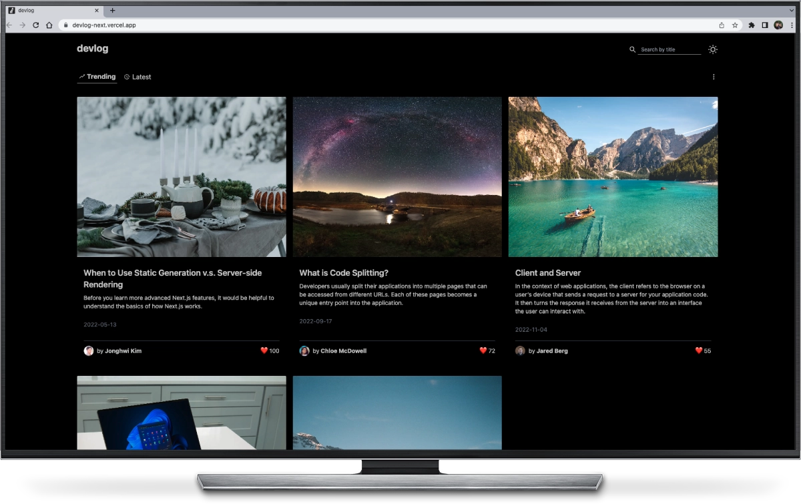

# Devlog

> Blog website built with NextJS & Typescript.

## Overview

- **How did I build it?**
  Devlog is an imitation website of [velog](https://velog.io/), the developer's blog. I'm currently studying how to use NextJS with Typescript. I created this website to learn from hands-on project.

- **What was the most challenging part?**
  The most challenging part was learning the new routing system of NextJS. I had to write code logics to get url params in order to fetch post data locally. I used the 'useRouter' hook of NextJS to achieve that. This code logic produced an pre-rendering type error that says I'm trying to use undefined data. I had to figure out what was causing the issue.

- **How did I solve it?**
  The problem occurred since the Post component is trying to use the url param before the page renders. I used the 'useEffect' hook to make the code run only after rendering.

- **What was the most fun part?**
  The most fun part was the cool development experience. The way of how React displays an error is showing white blank space only. Unlike that, NextJS shows an error on the browser which makes it easier to debug the code. The error log can be viewed in the terminal of the code editor, as well. This feature saves a lot of time debugging compared to using the developer's tool in the browser.

- **What did I learn?**
  I learned a new routing system in NextJS. It was more visually intuitive to structure routes under the pages folder. Along the way, I learned how to manipulate routes dynamically with new [fileNameFormat].tsx and URL params. I learned how to set type for variables, functions and parameters using TypeScript, as well. It was strictly required to write code with types in order to prevent type errors. I gained a better understanding of the main reason why people use TypeScript from this project.

- **What will I do differently next time?**
  If I were to start this project all over again, I'd want to research how to connect the NextJS app with Firebase first. I presumed that it would work the same as React which was not the case. When I tried to use Firebase with an app, It required a paid plan since my project was using Image tag for image optimization. I had to minimize the project scope to avoid using charged service. If I knew that ahead of time, I wouldn't waste time implementing something that I don't need.

## Technical Decision

- I used NextJS to develop the project with a more intuitive routing system. NextJS provides SEO-friendly features for React apps as well.
- I decided to use TypeScript more than JavaScript. Since TypeScript enables developers to add type safety to projects. I realized a lot of companies are starting to use more TypeScript for this reason.
- My specialty is programming and I'm looking for frontend web developer job. That's why I decided to focus more on developing rather than designing. Therefore I designed the project visually similar to [velog](https://velog.io/).

## Features

- 🌗 Light / dark mode: [Example code](https://github.com/bellhwi/devlog/blob/main/components/Navbar.tsx)
- 🔍 Search blog post: [Example code](https://github.com/bellhwi/devlog/blob/main/components/Navbar.tsx)
- 🗃️ Sort posts: [Example code](https://github.com/bellhwi/devlog/blob/main/components/Sort.tsx)
- 📱 Responsive design

## Tech

    
    
    
    
    

